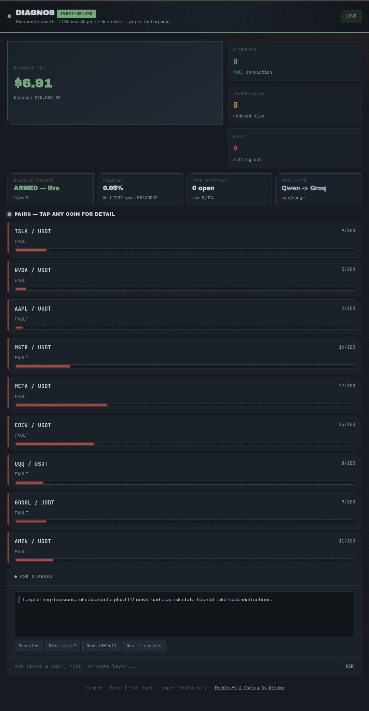
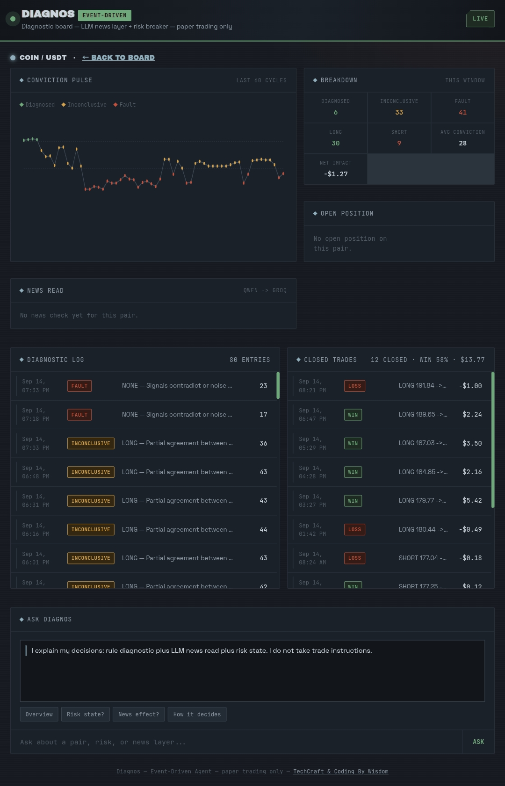
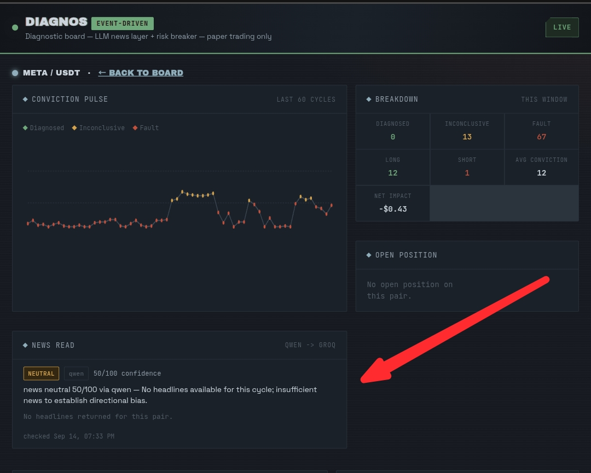
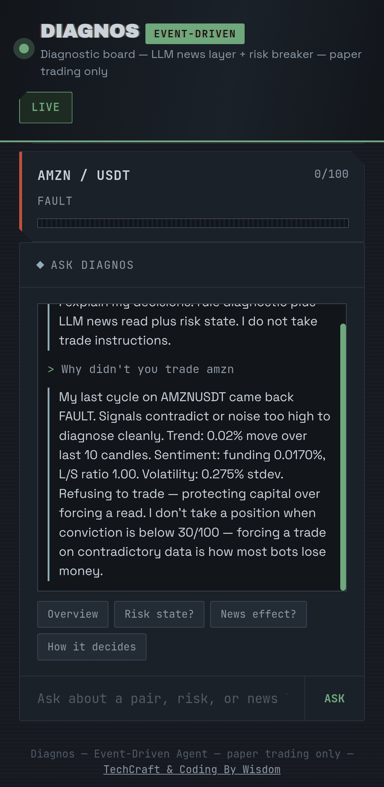

# Diagnos

An autonomous diagnostic trading agent, Agentic Trading track, Event-Driven Agent sub-theme.

Paper trading only. No real funds are used at any point.

Agent Link : https://diagnos-production-1844.up.railway.app

## Screenshots


*The home board — balance, conviction breakdown, risk strip, and all nine pairs at a glance.*


*Tap any pair for its conviction pulse chart, breakdown stats, and open position readout.*


*The LLM's actual news/event read for a pair — provider, confidence, bias, and the headlines it was given.*


*Fast keyword answers for common questions, a real LLM-grounded answer for anything else — grounded in live data, never able to accept a trade instruction.*

## The idea

Every cycle, Diagnos runs a diagnostic on the market and only commits paper size when its signals genuinely agree with each other. When they don't, it says so and refuses to trade rather than force a guess.

It trades nine **Bitget Stock Perps** — `TSLAUSDT, NVDAUSDT, AAPLUSDT, MSTRUSDT, METAUSDT, COINUSDT, QQQUSDT, GOOGLUSDT, AMZNUSDT` — USDT-margined perpetual futures on tokenized US stocks, confirmed live on the same `USDT-FUTURES` product type Bitget uses for crypto perps, sharing one paper balance across all nine.

It was originally built and validated against crypto pairs before switching to Stock Perps to match the hackathon's actual subject. A startup safeguard (`closeStalePositions()`) force-closes any position left open on a pair no longer tracked, so a universe swap like that one can't silently orphan capital.

### The four signals

| Signal | Source | Notes |
|---|---|---|
| **Trend** | Last 10 candles, % move | Same for every asset class |
| **Volatility** | Rolling stdev | Penalizes conviction when price is too noisy to trust |
| **Sentiment** | Funding rate + long/short ratio, extremes only, read as contrarian | **Structurally unavailable for Stock Perps** — Bitget's long/short endpoint returns no data at all for this asset class (confirmed via a live API call, not assumed). When that happens, sentiment falls back to the LLM news bias instead of staying permanently neutral — see below. |
| **LLM news read** | Qwen primary, Groq fallback | Fetched *before* the core diagnostic runs (not after), specifically so its bias can fill the sentiment gap above rather than arriving too late to matter |

Agreement between signals — not a raw average — produces a 0–100 conviction score:

| Conviction | State | Action |
|---|---|---|
| 0–29 | `FAULT` | Refuses to trade. Logs why. |
| 30–69 | `INCONCLUSIVE` | Reduced-size paper position. |
| 70–100 | `DIAGNOSED` | Full-size paper position. |

Separately from scoring, the LLM read can also **veto** a decision straight to `FAULT` on hard event risk (earnings, macro decisions, a hack, an ETF ruling) regardless of what the score says — that override is logged with which provider produced it and why, never applied silently.

**Cost control:** the LLM call is skipped entirely for any pair that already has an open position. A position's fate for the rest of its hold window is decided by the hold-timer and stop-loss, not by re-diagnosing every 15 minutes — so re-running the news call for it would cost a real API call for zero effect on behavior. Pairs without a position still get a full LLM read every cycle, since those are the ones actually being evaluated for a new trade.

## Risk controls

- **5%** hard cap on paper capital per position, regardless of conviction
- **Max 5** concurrent open positions
- **17.5%** account-level drawdown breaker — trading pauses (new positions only; existing ones still close normally) until a human reviews and calls `POST /resume`. Manual reset is deliberate: an agent that pauses and waits for review demonstrates risk discipline; one that quietly auto-resumes just demonstrates a delay.
- **2%** stop-loss per position, checked on its own faster timer independent of the main diagnostic cycle
- **1-hour hold window** per position — closes automatically at expiry regardless of what the diagnostic says by then. 

## Project structure

```
diagnos/
├── agent/
│   ├── agent.js         # diagnostic engine, risk controls, paper trading, status API
│   ├── newsSignal.js    # LLM news/event layer — Qwen primary, Groq fallback
│   ├── explain.js       # "ask Diagnos" — fast templates + LLM-grounded fallback
│   ├── package.json
│   ├── railway.json
│   └── data/            # generated at runtime, not committed (state.json, trades_log.csv, closed_trades.csv)
└── dashboard/
    └── index.html       # single-file live dashboard, no build step
```

## Running it yourself

**Requirements:** Node.js 18+ (uses the built-in `fetch`). A Bitget account isn't required — the agent only reads public market data.

```bash
cd agent
npm install   # no real dependencies, just a formality
node agent.js
```

Without `QWEN_API_KEY` / `GROQ_API_KEY` set, the news layer returns neutral and the agent runs on rule-based signals alone — it never crashes for missing keys.

## API

| Endpoint | Returns |
|---|---|
| `GET /status` | balance, cycle count, latest decision per pair (including its news read), risk block |
| `GET /log?n=100&pair=` | recent diagnostic log rows, optionally filtered |
| `GET /pnl?n=100&pair=` | closed positions, realized P&L, win rate |
| `GET /risk` | peak balance, drawdown, paused flag, breaker trip history |
| `GET /price/:pair` | live ticker price for one pair |
| `POST /resume` | manual breaker reset — human review step |
| `POST /ask` | `{"question": "..."}` → plain-language, data-grounded answer (template match, or LLM if nothing matches) |
| `GET /health` | `ok` |
| `POST /sync` | forces an immediate GitHub backup |

### Configuration

Everything lives in `CONFIG` at the top of `agent.js`. No environment variables are required to run it locally.

| Variable | Effect if set | If unset |
|---|---|---|
| `BITGET_API_KEY` | higher rate limits on market data | agent runs the same |
| `GITHUB_TOKEN` + `GITHUB_REPO` | hourly backup + restore-on-restart | log only persists locally, lost on restart |
| `QWEN_API_KEY` | LLM news layer, primary | falls through to Groq |
| `QWEN_BASE_URL` | overrides `https://hackathon.bitgetops.com/v1` | uses that default |
| `QWEN_MODEL` | overrides `qwen3-max` (code default) | uses that default — **set this explicitly to `qwen3.8-max` if you want to match the hackathon doc's recommended model exactly**, the two aren't the same string |
| `GROQ_API_KEY` | LLM news layer, fallback | news layer returns neutral if Qwen also unset/fails |
| `GROQ_MODEL` | overrides `llama-3.3-70b-versatile` | uses that default |
| `MAX_OPEN_POSITIONS` | overrides default of 5 | defaults to 5 |
| `DRAWDOWN_PCT` | overrides default of 0.175 (17.5%) | defaults to 0.175 |

## Deploying to Railway

1. Push this repo to GitHub.
2. New Railway project → deploy from the repo → set root directory to `agent`.
3. Railway reads `railway.json` and runs `node agent.js` automatically.
4. Add environment variables from the table above as needed — never commit them.
5. Generate a public domain, then paste it into the dashboard when it asks on first load.
6. Confirm the log is writing: `https://<your-domain>/log?n=5` should show rows within 15–20 minutes of start.
7. **Redeploy, don't just restart, after any code push** — a restart alone doesn't pull new commits.

## News source

`fetchHeadlinesForPair()` pulls from [cryptocurrency.cv](https://cryptocurrency.cv) — a free, no-key, no-signup news aggregator (300+ sources), queried per pair by company/index name (e.g. "Tesla" for TSLAUSDT) via its `/api/search` endpoint.

Two honest, checked-not-assumed constraints worth naming in a submission:

1. **Coverage for mainstream stock names is thinner than for crypto-adjacent ones.** MicroStrategy and Coinbase (crypto-proxy stocks) get reasonable coverage; pure-play names like Apple, Google, Amazon often come back with `"headlines":[]`. This isn't a bug — it's what an actual crypto-leaning aggregator returns for these tickers, checked live via the dashboard's News read panel, not assumed.
2. **The LLM only lets news move the score when it's actually confident** — headline-based bias below 60/100 confidence stays at value 0, deliberately. Combined with (1), this means the news layer contributes less than it could on Stock Perps specifically, purely due to source coverage, not a flaw in the LLM logic itself.

## Known behavior, not a bug

Every pair reading `FAULT` simultaneously for an extended stretch is **expected behavior when the underlying stock market is closed** (weekends, holidays) — Stock Perps technically trade 24/7, but the real reference price they track is effectively frozen when NYSE/NASDAQ aren't open, so trend signal genuinely has nothing to read. Refusing to force a trade on flat data is the whole thesis, not a malfunction — worth keeping as evidence in a submission rather than something to engineer around.

---

Built by — TechCraft & Coding By Wisdom.
